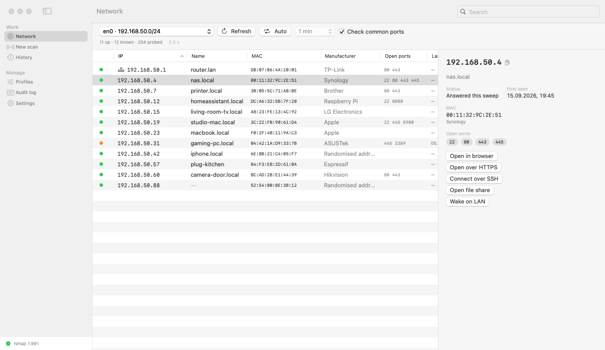
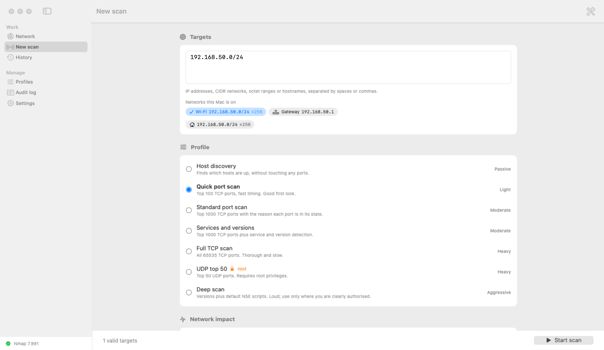
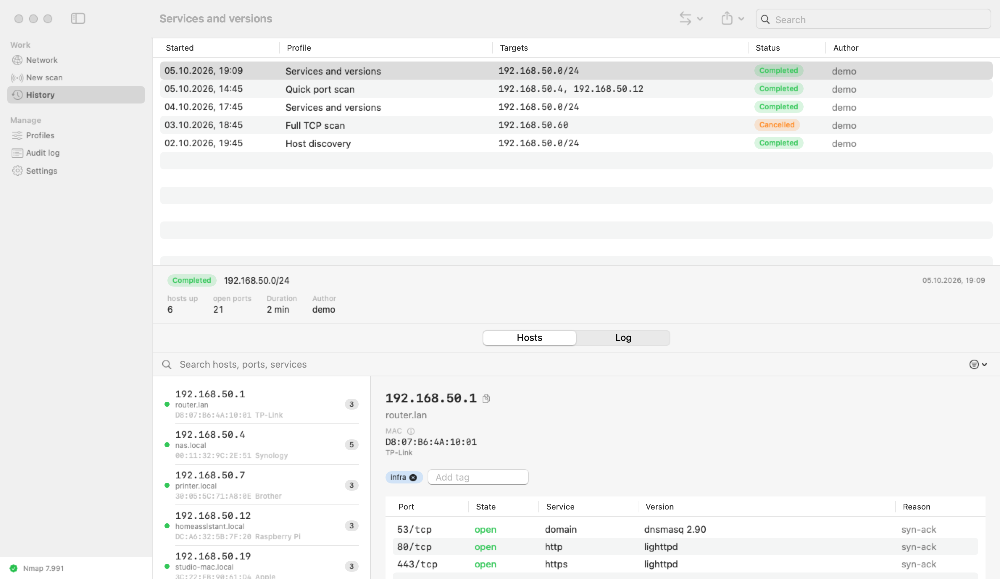
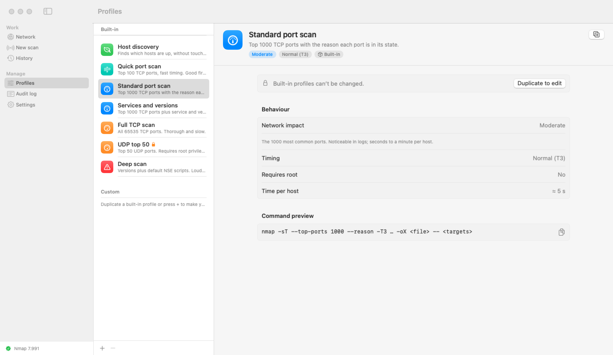

# Dozor

**A native macOS front-end for Nmap that keeps scans inside the networks you're allowed to look at.**

*Dozor* (Ukrainian *дозор*, "patrol") means a reconnaissance round: look at what's around you, within the limits you're allowed.
The app gives Nmap a readable interface, keeps a history of every scan, compares runs, exports reports, and adds guardrails so a scan doesn't go somewhere it shouldn't by accident.

<picture>
  <source media="(prefers-color-scheme: dark)" srcset="docs/screenshots/network-dark.png">
  
</picture>

> All screenshots use the built-in [demo mode](#demo-mode). The network, devices and history in them are made up.

---

## Features

### Network overview
A live table of the subnet this Mac is on. You don't type the range: you pick it from the Mac's active network interfaces, so this mode can't be aimed at a network you're not connected to.

- **Fast discovery without root.** ICMP echo is sent through an unprivileged socket, which also fills the kernel's ARP cache. On a /24 this found 36 hosts in 3.2 s. `nmap -sn` without root found 20 hosts in 20.8 s on the same network.
- **Name, MAC address and manufacturer** for every device. The device's state is shown as one of *up*, *recently seen* or *gone*. Hosts stay in the table after they go quiet, so a sleeping laptop doesn't just disappear.
- **Common-port check** (SSH, HTTP/S, SMB, VNC, RDP). Each open port adds a one-click action: open in browser, connect over SSH, open the file share, start screen sharing, or send **Wake-on-LAN**.
- **Auto-refresh** every 30 s, 1 min or 5 min. Policy sets a minimum interval between sweeps and a time limit, so the app can't keep sweeping after you stop watching.
- **Hand-off to a full scan.** Select hosts and send them to the scan form.

### Scanning
<picture>
  <source media="(prefers-color-scheme: dark)" srcset="docs/screenshots/scan-dark.png">
  
</picture>

- **Seven built-in profiles**, from host discovery to a full TCP scan and a deep scan with NSE scripts. Each one is labelled with how much it loads the network and shows an estimated run time.
- **Targets:** IPv4/IPv6 addresses, CIDR networks, octet ranges (`10.0.0.1-50`) and hostnames, checked as you type.
- **Suggested ranges:** chips for the networks this Mac is on and their gateways. A click fills in the field, and the target still goes through the same checks as anything you type.
- **Advanced mode** (⇧⌘E) lets you override ports and timing.
- **Confirmation sheet** before every run. It shows the targets, the address count, the expected duration, the network impact, the exact command line, and asks you to confirm you're authorised to scan these targets.
- **Live progress:** progress bar, time remaining, and the Nmap log as it runs.

### Results and history
<picture>
  <source media="(prefers-color-scheme: dark)" srcset="docs/screenshots/history-dark.png">
  
</picture>

- **Hosts, ports, services, versions** and Nmap's reason for each port state. You can tag hosts.
- **MAC address and manufacturer without root.** A non-root scan can't see MAC addresses itself. Right after a scan the system's ARP cache is up to date, so Dozor reads it with one `sysctl` call. Manufacturers come from the prefix table that ships with Nmap. Randomised (private) MAC addresses are labelled as such instead of being matched to a manufacturer.
- **`.local` names:** hosts Nmap couldn't name are looked up with the system resolver, which also sees mDNS.
- **Search and filters** by address, name, MAC, manufacturer, service or tag. Copy any field, or the whole host row.
- **Every run is saved** with its parameters, author, time, log and result.
- **Compare two runs:** new and missing hosts, newly opened and closed ports, changed service versions.
- **Export** to JSON, CSV, Nmap XML or a self-contained HTML report (print it to get a PDF).

### Profiles
<picture>
  <source media="(prefers-color-scheme: dark)" srcset="docs/screenshots/profiles-dark.png">
  
</picture>

- Built-in profiles are read-only. Duplicate one to make your own.
- Custom profiles have a name, description, Nmap arguments, network impact, timing template and a root flag.
- Arguments are checked against an allow-list as you type, and a live preview shows the exact command.

### Everything else
- **Audit log** of every scan request, block, start, finish and export, and every profile or policy change.
- **Policy settings:** authorised assets, impact levels that need confirmation or are refused, packet-rate and parallelism caps, a maximum number of addresses per run, and one scan at a time.
- **English and Ukrainian.** You can switch language without restarting.
- **Text size** ⌘+ / ⌘− / ⌘0, eight steps from 80 % to 200 %.
- Light and dark appearance, standard macOS controls.

---

## Safety model

This tool sends packets to other machines, so the guardrails are part of the design rather than extra settings.

- **No shell.** Nmap is started with `posix_spawn` and an argument list. Nothing you type goes through a shell, so there's no word-splitting, globbing or substitution. The child process gets a fixed environment.
- **Validated targets.** Only well-formed addresses, networks, ranges and hostnames are accepted. Anything that starts with `-` is rejected, and `--` before the targets stops Nmap from reading them as options.
- **Allow-listed arguments.** Unknown flags are rejected, not escaped. The app sets the output flags itself (`-oX`, `-iL`, `--datadir`, …), and profiles can't use them. NSE scripts are limited to safe categories.
- **Authorised assets.** Targets outside private address space must be on the allow-list in Settings, or the scan is blocked. Riskier impact levels need confirmation or are refused.
- **Rate limits are added by the app.** `--max-rate`, `--max-parallelism`, `--max-hostgroup` and the per-run address cap are always appended, so a profile can't remove them.
- **Local data only.** Everything is stored in `~/Library/Application Support/Dozor`: the directory is `0700`, the files are `0600`. Nothing is sent anywhere.
- **Safe parsing and export.** External entities are disabled when parsing Nmap XML. Service banners come from the scanned host, so they're escaped in HTML reports and quoted in CSV.

> Scanning networks without permission is illegal in many places. Dozor makes it hard to do by accident, but you're responsible for where you point it.

---

## Requirements

- macOS 14 or later
- Nmap: `brew install nmap` (detected automatically; you can also set the path in Settings)
- Xcode Command Line Tools. Full Xcode isn't required.

Dozor runs without root privileges and uses TCP connect scans. Profiles that need root (SYN, UDP, OS detection) are blocked unless the app itself runs as root.

## Build and run

```bash
git clone https://github.com/wkornilow/dozor.git
cd dozor
./Scripts/bundle.sh          # builds build/Dozor.app (the icon is generated on the fly)
open build/Dozor.app
```

To build the universal (Apple silicon + Intel) release archive in `release/<version>/`, run `./Scripts/release.sh`. The version defaults to the one in `Scripts/bundle.sh`; override it with `VERSION=x.y.z`.

The bundle is signed ad-hoc so it launches locally. The app isn't sandboxed because a sandboxed process can't launch `/opt/homebrew/bin/nmap`.

> **Build fails with `plugin for module 'SwiftUIMacros' not found`?** Some Command Line Tools releases ship an SDK whose SwiftUI macros they can't expand. Build against an older SDK that's also installed:
> ```bash
> SDKROOT=/Library/Developer/CommandLineTools/SDKs/MacOSX26.5.sdk ./Scripts/bundle.sh
> ```

### Tests

```bash
swift run DozorKitTests                         # core test suite
DOZOR_LIVE=1 swift run DozorKitTests            # also run a real scan of 127.0.0.1
DOZOR_DUMP_NETWORKS=1 swift run DozorKitTests   # print the networks this Mac is on
```

XCTest and swift-testing only come with Xcode, so the suite is a plain executable with its own small test harness.

### Demo mode

```bash
DOZOR_DEMO=1 build/Dozor.app/Contents/MacOS/Dozor
```

Demo mode runs the app with a made-up home network and scan history. Its data is kept in a temporary directory, separate from your real history, profiles and audit log. The network overview never sends packets in this mode. A scan you start yourself from the Scan screen still runs Nmap for real.

To regenerate the screenshots in this README:

```bash
DOZOR_DEMO=1 DOZOR_SCREENSHOTS=docs/screenshots build/Dozor.app/Contents/MacOS/Dozor
```

The app opens each screen in light and dark appearance, renders its own window to PNG, and quits. It doesn't need Screen Recording permission.

---

## Architecture

| Module | Purpose |
|---|---|
| `Sources/DozorKit` | Core with no UI: target validation, policy, process runner, XML parser, subnet sweeper, storage, export, diff. No dependencies beyond Foundation, so it can be ported. |
| `Sources/Dozor` | SwiftUI + AppKit app: network overview, scanning, results, history, profiles, settings, audit log. |
| `Tests/DozorKitTests` | Tests for the core. |
| `Scripts/` | `bundle.sh` assembles the `.app` without Xcode. `release.sh` packs a universal build for a release. `make-icon.swift` draws the icon from vector code. |

It's a plain SwiftPM package with no Xcode project.

## Roadmap

- Scheduled scans with notifications
- A privileged helper for root scans (SYN/UDP/OS) instead of running the whole app as root
- Encrypting saved results with a key stored in the Keychain
- Direct PDF export
- Porting the core to Linux/Windows or a headless agent

## License

[MIT](LICENSE)

Nmap is a trademark of Insecure.Com LLC. Dozor isn't affiliated with the Nmap project; it runs Nmap as an external tool, which you install yourself.
